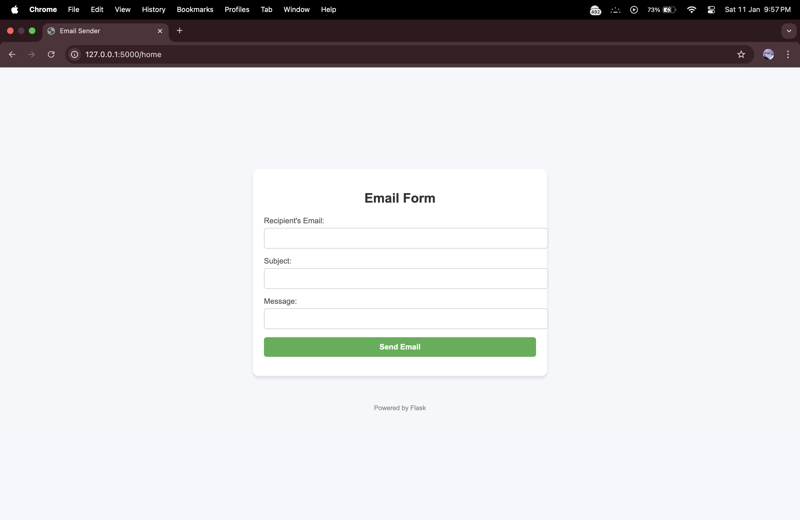

# Mail Gun - Email Sending Flask Application

This is a simple Flask application that allows you to send emails using Gmail's SMTP server. The app collects the recipient's email address, subject, and message from a form and sends the email to the provided address.

## Features

- **Send Emails**: Users can send emails to any recipient using the provided form.
- **Gmail SMTP**: The app uses Gmail's SMTP server to send emails securely.
- **Form Validation**: Basic validation ensures that the required fields (email, subject, and message) are filled before sending the email.
- **Environment Variables**: The Gmail password is securely stored using environment variables, with the help of Python's `dotenv` library.

## Installation

Follow these steps to set up the project locally:

### 1. Clone the Repository

Clone this repository to your local machine:

```bash
git clone https://github.com/Rahil71/Mail_gun.git
cd Mail_gun
```

### 2. Set Up a Virtual Environment

Create a virtual environment (optional but recommended):

```bash
python3 -m venv venv
```

Activate the virtual environment:

- On Windows:
  ```bash
  venv\Scripts\activate
  ```

- On macOS/Linux:
  ```bash
  source venv/bin/activate
  ```

### 3. Install Dependencies

Install the required Python libraries:

```bash
pip install -r requirements.txt
```

### 4. Set Up Environment Variables

Create a `.env` file in the root directory of your project and add your Gmail password:

```env
gmail_password=your_gmail_password
```

Make sure to replace `your_gmail_password` with your actual Gmail password. This password will be used to authenticate with Gmail's SMTP server.

> **Important**: To use Gmail's SMTP server securely, you may need to enable "Less secure apps" in your Gmail account settings or generate an **App Password** if you have 2-Step Verification enabled. For security reasons, it's recommended to use App Passwords.

### 5. Run the Application

To start the Flask application, run:

```bash
python app.py
```

The app will run locally on `http://127.0.0.1:5000/`.

## Screenshot



## Usage

1. Open your browser and navigate to `http://127.0.0.1:5000/`.
2. Fill in the recipient's email address, subject, and message.
3. Click the "Send Email" button to send the email to the provided address.

## Contributing

If you'd like to contribute to this project, feel free to fork the repository, make changes, and submit a pull request. All contributions are welcome!

## License

This project is licensed under the MIT License - see the [LICENSE](LICENSE) file for details.

## Acknowledgements

- Flask: A lightweight WSGI web application framework.
- Flask-Mail: Extension for Flask that adds email support.
- Python-dotenv: To load environment variables from a `.env` file.
- Gmail SMTP: Used for sending emails securely.
